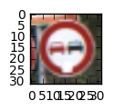
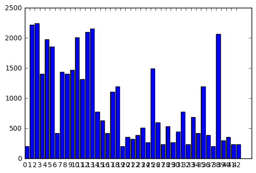
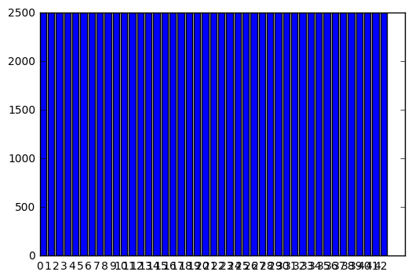
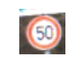
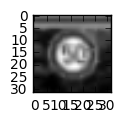
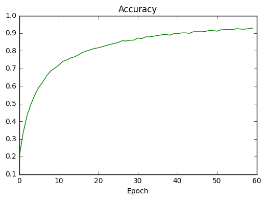
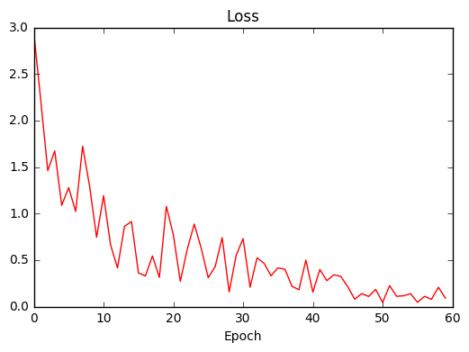
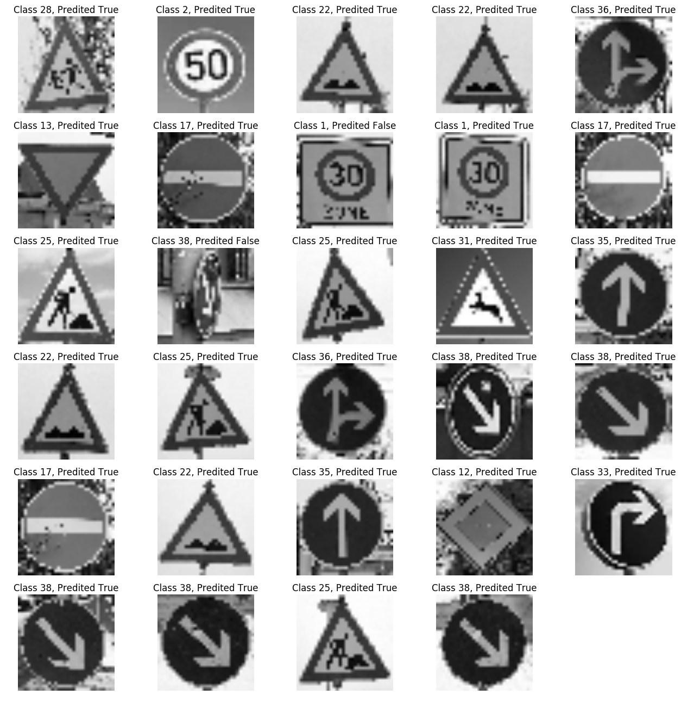
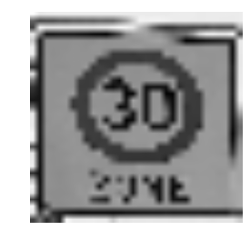
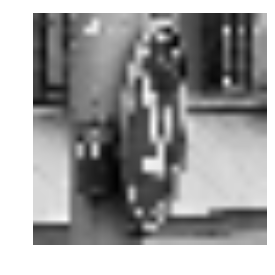

# Self-Driving Car Engineer Nanodegree

## Deep Learning

## Project: Build a Traffic Sign Recognition Classifier

In this notebook, a template is provided for you to implement your functionality in stages which is required to successfully complete this project. If additional code is required that cannot be included in the notebook, be sure that the Python code is successfully imported and included in your submission, if necessary. Sections that begin with **'Implementation'** in the header indicate where you should begin your implementation for your project. Note that some sections of implementation are optional, and will be marked with **'Optional'** in the header.

In addition to implementing code, there will be questions that you must answer which relate to the project and your implementation. Each section where you will answer a question is preceded by a **'Question'** header. Carefully read each question and provide thorough answers in the following text boxes that begin with **'Answer:'**. Your project submission will be evaluated based on your answers to each of the questions and the implementation you provide.

>**Note:** Code and Markdown cells can be executed using the **Shift + Enter** keyboard shortcut. In addition, Markdown cells can be edited by typically double-clicking the cell to enter edit mode.

---
## Step 0: Load The Data


```python
# Load pickled data
import pickle
import pprint

# TODO: Fill this in based on where you saved the training and testing data

training_file = "train.p"
testing_file = "test.p"

with open(training_file, mode='rb') as f:
    train = pickle.load(f)
with open(testing_file, mode='rb') as f:
    test = pickle.load(f)
    
X_train, y_train = train['features'], train['labels']
X_test, y_test = test['features'], test['labels']

assert(len(X_train) == len(y_train))
assert(len(X_test) == len(y_test))

print()
print("Image Shape: {}".format(X_train[0].shape))
print()
print("Training Set:   {} samples".format(len(X_train)))
print("Test Set:       {} samples".format(len(X_test)))

```

    
    Image Shape: (32, 32, 3)
    
    Training Set:   39209 samples
    Test Set:       12630 samples
    

---

## Step 1: Dataset Summary & Exploration

The pickled data is a dictionary with 4 key/value pairs:

- `'features'` is a 4D array containing raw pixel data of the traffic sign images, (num examples, width, height, channels).
- `'labels'` is a 2D array containing the label/class id of the traffic sign. The file `signnames.csv` contains id -> name mappings for each id.
- `'sizes'` is a list containing tuples, (width, height) representing the the original width and height the image.
- `'coords'` is a list containing tuples, (x1, y1, x2, y2) representing coordinates of a bounding box around the sign in the image. **THESE COORDINATES ASSUME THE ORIGINAL IMAGE. THE PICKLED DATA CONTAINS RESIZED VERSIONS (32 by 32) OF THESE IMAGES**

Complete the basic data summary below.


```python
### Replace each question mark with the appropriate value.

# TODO: Number of training examples
n_train = len(X_train)

# TODO: Number of testing examples.
n_test = len(X_test)

# TODO: What's the shape of an traffic sign image?
image_shape = X_train[0].shape

# TODO: How many unique classes/labels there are in the dataset.
n_classes = 43 #if we open the signnames.csv we'll find 43 unique classes

print("Number of training examples =", n_train)
print("Number of testing examples =", n_test)
print("Image data shape =", image_shape)
print("Number of classes =", n_classes)
```

    Number of training examples = 39209
    Number of testing examples = 12630
    Image data shape = (32, 32, 3)
    Number of classes = 43
    

Visualize the German Traffic Signs Dataset using the pickled file(s). This is open ended, suggestions include: plotting traffic sign images, plotting the count of each sign, etc.

The [Matplotlib](http://matplotlib.org/) [examples](http://matplotlib.org/examples/index.html) and [gallery](http://matplotlib.org/gallery.html) pages are a great resource for doing visualizations in Python.

**NOTE:** It's recommended you start with something simple first. If you wish to do more, come back to it after you've completed the rest of the sections.


```python
### Data exploration visualization goes here.
### Feel free to use as many code cells as needed.
import matplotlib.pyplot as plt
import random
import numpy as np
# Visualizations will be shown in the notebook.
%matplotlib inline

index = random.randint(0, len(X_train))
image = X_train[index].squeeze()

plt.figure(figsize=(1,1))
plt.imshow(image)
print(y_train[index])
```

    9
    





## MyCODE - Dataset Stats

If we print the some database stats we notice that the dataset is unbalanced


```python
from pprint import pprint

grouped_ds = dict()

def dataset_stats(X_train):
    stats = dict()
    for i,image in enumerate(X_train):
        if y_train[i] not in stats:
            stats[y_train[i]] = 0
            grouped_ds[y_train[i]] = []
        else:
            stats[y_train[i]] = stats[y_train[i]] + 1
            grouped_ds[y_train[i]].append(image)
    return stats
        
print(len(X_train))
stats = dataset_stats(X_train)

plt.bar(range(len(stats)), stats.values())
plt.xticks(range(len(stats)), stats.keys())
plt.show()
```

    39209
    





From the graph above we can see that our data is unbalanced so we can jitter our images to balance the classes.

## Generate jittered data


```python
import cv2
from sklearn.utils import shuffle

def transform_image(img,ang_range,shear_range,trans_range):
    '''
    This function transforms images to generate new images.
    The function takes in following arguments,
    1- Image
    2- ang_range: Range of angles for rotation
    3- shear_range: Range of values to apply affine transform to
    4- trans_range: Range of values to apply translations over. 
    
    A Random uniform distribution is used to generate different parameters for transformation
    
    @From udacity forum
    '''
    # Rotation

    ang_rot = np.random.uniform(ang_range)-ang_range/2
    rows,cols,ch = img.shape    
    Rot_M = cv2.getRotationMatrix2D((cols/2,rows/2),ang_rot,1)

    # Translation
    tr_x = trans_range*np.random.uniform()-trans_range/2
    tr_y = trans_range*np.random.uniform()-trans_range/2
    Trans_M = np.float32([[1,0,tr_x],[0,1,tr_y]])

    # Shear
    pts1 = np.float32([[5,5],[20,5],[5,20]])

    pt1 = 5+shear_range*np.random.uniform()-shear_range/2
    pt2 = 20+shear_range*np.random.uniform()-shear_range/2

    pts2 = np.float32([[pt1,5],[pt2,pt1],[5,pt2]])

    shear_M = cv2.getAffineTransform(pts1,pts2)
        
    img = cv2.warpAffine(img,Rot_M,(cols,rows))
    img = cv2.warpAffine(img,Trans_M,(cols,rows))
    img = cv2.warpAffine(img,shear_M,(cols,rows))
    
    return img

#Generate jitter images for each classes.

tot_jitter_generate = 0
fgen = []
lgen = []

for label, value in stats.items():
    jrange = 2500 - value
    for i in range(0, jrange):
        index = random.randint(0, len(grouped_ds[label]) - 1)
        img = grouped_ds[label][index].squeeze()
        fgen.append(transform_image(img,30,2,1))
        lgen.append(label)
        tot_jitter_generate += 1

assert(len(fgen) == len(lgen))
fgen = np.array(fgen)
lgen = np.array(lgen)
X_train = np.concatenate([X_train, fgen])
y_train = np.concatenate([y_train, lgen])
        
#Print the stats
pprint("New dimension of X_train: {}".format(len(X_train)))
pprint("Images generated: {}".format(tot_jitter_generate))

stats2 = dataset_stats(X_train)

plt.bar(range(len(stats2)), stats2.values())
plt.xticks(range(len(stats2)), stats2.keys())
plt.show()
```

    'New dimension of X_train: 107543'
    'Images generated: 68334'
    





Now all classes are balanced!


```python
#Visualize some random result
index = random.randint(0, len(X_train))
image = X_train[index].squeeze()

plt.figure(figsize=(1,5))
plt.axis('off')
plt.imshow(image)
print("Class: {}".format(y_train[index]))
```

    Class: 2
    





## Save Jittered datasets


```python
jittered_dataset = {
    "features" : X_train,
    "labels"   : y_train
}

file_pi = open('train_jittered.pickle', 'wb') 
pickle.dump(jittered_dataset, file_pi)
```

## MyCODE - Data Preprocessing

Change channel from RGB to GRAYSCALE channel and normalize the data from 0 to 1


```python
def to_gray(img):
    return cv2.cvtColor(img, cv2.COLOR_RGB2GRAY)

def normalize(img):
    """Normalize the data from 0 to 1
    """
    return img.astype(float) / 255.0
```


```python
#Convert the image from RGB to GRAY channel
X_train_yuv = []
X_test_yuv = []

for image in X_train:
    X_train_yuv.append(normalize(to_gray(image)))
    
XYUV_train = np.array(X_train_yuv).reshape((-1,32,32,1))    

for image in X_test:
    X_test_yuv.append(normalize(to_gray(image)))

XYUV_test = np.array(X_test_yuv).reshape((-1,32,32,1))
```


```python
#Visualize the results
index = random.randint(0, len(XYUV_train))
image = XYUV_train[index].squeeze()

print(len(XYUV_train))

plt.figure(figsize=(1,1))
plt.imshow(image, cmap="gray")
print(y_train[index])
```

    107543
    2
    





## Save preprocessed datasets


```python
prepro_dataset = {
    "features" : XYUV_train,
    "labels"   : y_train
}

prepro_test_dataset = {
    "features" : XYUV_test,
    "labels"   : y_test
}

file_prepro = open('train_preprocessed.pickle', 'wb') 
pickle.dump(prepro_dataset, file_prepro, protocol=4)

file_prepro_test = open('test_preprocessed.pickle', 'wb') 
pickle.dump(prepro_test_dataset, file_prepro_test, protocol=4)
```

## Load preprocessed dataset
We can restart from here


```python
# Load pickled data
import pickle

training_file = "train_preprocessed.pickle"
testing_file = "test_preprocessed.pickle"

with open(training_file, mode='rb') as f:
    XYUV_train = pickle.load(f)
with open(testing_file, mode='rb') as f:
    XYUV_test = pickle.load(f)

X_train, y_train = XYUV_train['features'], XYUV_train['labels']
X_test, y_test = XYUV_test['features'], XYUV_test['labels']
```

## Create Validation set


```python
from sklearn.utils import shuffle
from sklearn.model_selection import train_test_split
#Create validation 
X_train, y_train = shuffle(X_train, y_train)
X_train, X_validation, y_train, y_validation = train_test_split(X_train, y_train, test_size=0.20, random_state=33)

assert(len(X_validation) == len(y_validation))
print("Validation Set: {} samples".format(len(X_validation)))
print("Train Set: {} samples".format(len(X_train)))
```

    Validation Set: 21509 samples
    Train Set: 86034 samples
    

----

## Step 2: Design and Test a Model Architecture

Design and implement a deep learning model that learns to recognize traffic signs. Train and test your model on the [German Traffic Sign Dataset](http://benchmark.ini.rub.de/?section=gtsrb&subsection=dataset).

There are various aspects to consider when thinking about this problem:

- Neural network architecture
- Play around preprocessing techniques (normalization, rgb to grayscale, etc)
- Number of examples per label (some have more than others).
- Generate fake data.

Here is an example of a [published baseline model on this problem](http://yann.lecun.com/exdb/publis/pdf/sermanet-ijcnn-11.pdf). It's not required to be familiar with the approach used in the paper but, it's good practice to try to read papers like these.

**NOTE:** The LeNet-5 implementation shown in the [classroom](https://classroom.udacity.com/nanodegrees/nd013/parts/fbf77062-5703-404e-b60c-95b78b2f3f9e/modules/6df7ae49-c61c-4bb2-a23e-6527e69209ec/lessons/601ae704-1035-4287-8b11-e2c2716217ad/concepts/d4aca031-508f-4e0b-b493-e7b706120f81) at the end of the CNN lesson is a solid starting point. You'll have to change the number of classes and possibly the preprocessing, but aside from that it's plug and play!

### Implementation

Use the code cell (or multiple code cells, if necessary) to implement the first step of your project. Once you have completed your implementation and are satisfied with the results, be sure to thoroughly answer the questions that follow.

## My CCN Architecture


```python
import tensorflow as tf
from tensorflow.contrib.layers import flatten
from sklearn.utils import shuffle

EPOCHS = 60
BATCH_SIZE = 96

n_classes = 43

def LeNet(x, drop):    
    # Hyperparameters
    mu = 0
    sigma = 0.1
    dropout = drop
    
    # Layer 1: Convolutional. Input = 32x32x1. Output = 28x28x6.
    conv1_W = tf.Variable(tf.truncated_normal(shape=(5, 5, 1, 6), mean = mu, stddev = sigma))
    conv1_b = tf.Variable(tf.zeros(6))
    conv1   = tf.nn.conv2d(x, conv1_W, strides=[1, 1, 1, 1], padding='VALID') + conv1_b

    # Activation.
    conv1 = tf.nn.relu(conv1)

    # Pooling. Input = 28x28x6. Output = 14x14x6.
    conv1 = tf.nn.max_pool(conv1, ksize=[1, 2, 2, 1], strides=[1, 2, 2, 1], padding='VALID')

    # Layer 2: Convolutional. Output = 10x10x20.
    conv2_W = tf.Variable(tf.truncated_normal(shape=(5, 5, 6, 20), mean = mu, stddev = sigma))
    conv2_b = tf.Variable(tf.zeros(20))
    conv2   = tf.nn.conv2d(conv1, conv2_W, strides=[1, 1, 1, 1], padding='VALID') + conv2_b
    
    # SOLUTION: Activation.
    conv2 = tf.nn.relu(conv2)

    # Pooling. Input = 10x10x20. Output = 5x5x20.
    conv2 = tf.nn.max_pool(conv2, ksize=[1, 2, 2, 1], strides=[1, 2, 2, 1], padding='VALID')

    # Flatten. Input = 5x5x20. Output = 500.
    fc0   = flatten(conv2)
    
    # Layer 3: Fully Connected. Input = 500. Output = 250.
    fc1_W = tf.Variable(tf.truncated_normal(shape=(500, 250), mean = mu, stddev = sigma))
    fc1_b = tf.Variable(tf.zeros(250))
    fc1   = tf.matmul(fc0, fc1_W) + fc1_b
    
    # Activation.
    fc1    = tf.nn.relu(fc1)
    
    # Layer 4: Fully Connected. Input = 250. Output = 125.
    fc2_W  = tf.Variable(tf.truncated_normal(shape=(250, 125), mean = mu, stddev = sigma))
    fc2_b  = tf.Variable(tf.zeros(125))
    fc2    = tf.matmul(fc1, fc2_W) + fc2_b
    
    # Activation.
    fc2 = tf.nn.relu(fc2)
    
    #Regularization
    fc2 = tf.nn.dropout(fc2, dropout)

    # Layer 5: Fully Connected. Input = 125. Output = 43.
    fc3_W  = tf.Variable(tf.truncated_normal(shape=(125, 43), mean = mu, stddev = sigma))
    fc3_b  = tf.Variable(tf.zeros(43))
    logits = tf.matmul(fc2, fc3_W) + fc3_b
    
    return logits
```


```python
###Features and labels

x = tf.placeholder(tf.float32, (None, 32, 32, 1))
y = tf.placeholder(tf.int32, (None))
drop = tf.placeholder(tf.float32)
one_hot_y = tf.one_hot(y, n_classes)
```

## TRAINING PIPELINE


```python
#Learning rate deay values
START_RATE = 1e-4
decay_steps = 100000
decay_size = 0.95

# Optimizer. Learning reate decay
# count the number of steps taken.
global_step = tf.Variable(0) 

logits = LeNet(x, drop)
cross_entropy = tf.nn.softmax_cross_entropy_with_logits(logits, one_hot_y)
loss_operation = tf.reduce_mean(cross_entropy)

#Calculate learning rate
rate = tf.train.exponential_decay(START_RATE, global_step, decay_steps, decay_size )

optimizer = tf.train.AdamOptimizer(learning_rate = rate)
training_operation = optimizer.minimize(loss_operation)
```

## Model Evaluation
Evaluate how well the loss and accuracy of the model for a given dataset.


```python
correct_prediction = tf.equal(tf.argmax(logits, 1), tf.argmax(one_hot_y, 1))
accuracy_operation = tf.reduce_mean(tf.cast(correct_prediction, tf.float32))
saver = tf.train.Saver(tf.global_variables())

def evaluate(X_data, y_data, drop_pred):
    num_examples = len(X_data)
    total_accuracy = 0
    sess = tf.get_default_session()
    for offset in range(0, num_examples, BATCH_SIZE):
        batch_x, batch_y = X_data[offset:offset+BATCH_SIZE], y_data[offset:offset+BATCH_SIZE]
        accuracy = sess.run(accuracy_operation, feed_dict={x: batch_x, y: batch_y, drop : drop_pred})
        total_accuracy += (accuracy * len(batch_x))
    return total_accuracy / num_examples
```

## Train the Model with jitter


```python
accs = dict()
costs = dict()

with tf.Session() as sess:
    sess.run(tf.global_variables_initializer())
    num_examples = len(X_train)

    print("Training...")
    print()
    for epoch_i in range(EPOCHS):
        
        X_train, y_train = shuffle(X_train, y_train)
        for offset in range(0, num_examples, BATCH_SIZE):
            end = offset + BATCH_SIZE
            batch_x, batch_y = X_train[offset:end], y_train[offset:end]
            sess.run(training_operation, feed_dict={x: batch_x, y: batch_y, drop : 0.25})
        
        #Calculate the cost
        current_cost = sess.run(
            loss_operation,
            feed_dict={x: batch_x, y: batch_y, drop : 0.25})
        
        costs[epoch_i] = current_cost    
        
        #Calculate the accurancy for the epoch
        validation_accuracy = evaluate(X_validation, y_validation, 0.25)
        accs[epoch_i] = validation_accuracy
        
        print('Epoch: {:<4}  Cost: {:<8.3} Valid Accuracy: {:<5.3} '.format(
            epoch_i,
            current_cost,
            validation_accuracy))
        
    saver.save(sess, 'model_gpu.ckpt')
    print("Model saved")
```

    Training...
    
    Epoch: 0     Cost: 2.95     Valid Accuracy: 0.195 
    Epoch: 1     Cost: 2.21     Valid Accuracy: 0.334 
    Epoch: 2     Cost: 1.46     Valid Accuracy: 0.434 
    Epoch: 3     Cost: 1.67     Valid Accuracy: 0.499 
    Epoch: 4     Cost: 1.09     Valid Accuracy: 0.552 
    Epoch: 5     Cost: 1.28     Valid Accuracy: 0.594 
    Epoch: 6     Cost: 1.02     Valid Accuracy: 0.624 
    Epoch: 7     Cost: 1.72     Valid Accuracy: 0.66  
    Epoch: 8     Cost: 1.29     Valid Accuracy: 0.686 
    Epoch: 9     Cost: 0.745    Valid Accuracy: 0.702 
    Epoch: 10    Cost: 1.19     Valid Accuracy: 0.719 
    Epoch: 11    Cost: 0.664    Valid Accuracy: 0.74  
    Epoch: 12    Cost: 0.415    Valid Accuracy: 0.748 
    Epoch: 13    Cost: 0.862    Valid Accuracy: 0.759 
    Epoch: 14    Cost: 0.914    Valid Accuracy: 0.766 
    Epoch: 15    Cost: 0.361    Valid Accuracy: 0.777 
    Epoch: 16    Cost: 0.329    Valid Accuracy: 0.791 
    Epoch: 17    Cost: 0.544    Valid Accuracy: 0.799 
    Epoch: 18    Cost: 0.313    Valid Accuracy: 0.806 
    Epoch: 19    Cost: 1.08     Valid Accuracy: 0.814 
    Epoch: 20    Cost: 0.771    Valid Accuracy: 0.817 
    Epoch: 21    Cost: 0.27     Valid Accuracy: 0.824 
    Epoch: 22    Cost: 0.617    Valid Accuracy: 0.83  
    Epoch: 23    Cost: 0.886    Valid Accuracy: 0.837 
    Epoch: 24    Cost: 0.626    Valid Accuracy: 0.842 
    Epoch: 25    Cost: 0.309    Valid Accuracy: 0.847 
    Epoch: 26    Cost: 0.43     Valid Accuracy: 0.857 
    Epoch: 27    Cost: 0.741    Valid Accuracy: 0.856 
    Epoch: 28    Cost: 0.157    Valid Accuracy: 0.86  
    Epoch: 29    Cost: 0.549    Valid Accuracy: 0.861 
    Epoch: 30    Cost: 0.73     Valid Accuracy: 0.872 
    Epoch: 31    Cost: 0.207    Valid Accuracy: 0.87  
    Epoch: 32    Cost: 0.523    Valid Accuracy: 0.879 
    Epoch: 33    Cost: 0.466    Valid Accuracy: 0.88  
    Epoch: 34    Cost: 0.33     Valid Accuracy: 0.883 
    Epoch: 35    Cost: 0.416    Valid Accuracy: 0.887 
    Epoch: 36    Cost: 0.399    Valid Accuracy: 0.891 
    Epoch: 37    Cost: 0.218    Valid Accuracy: 0.894 
    Epoch: 38    Cost: 0.181    Valid Accuracy: 0.889 
    Epoch: 39    Cost: 0.499    Valid Accuracy: 0.897 
    Epoch: 40    Cost: 0.154    Valid Accuracy: 0.897 
    Epoch: 41    Cost: 0.398    Valid Accuracy: 0.902 
    Epoch: 42    Cost: 0.278    Valid Accuracy: 0.902 
    Epoch: 43    Cost: 0.341    Valid Accuracy: 0.899 
    Epoch: 44    Cost: 0.324    Valid Accuracy: 0.908 
    Epoch: 45    Cost: 0.213    Valid Accuracy: 0.909 
    Epoch: 46    Cost: 0.0789   Valid Accuracy: 0.909 
    Epoch: 47    Cost: 0.139    Valid Accuracy: 0.91  
    Epoch: 48    Cost: 0.108    Valid Accuracy: 0.916 
    Epoch: 49    Cost: 0.184    Valid Accuracy: 0.915 
    Epoch: 50    Cost: 0.0443   Valid Accuracy: 0.912 
    Epoch: 51    Cost: 0.225    Valid Accuracy: 0.92  
    Epoch: 52    Cost: 0.11     Valid Accuracy: 0.921 
    Epoch: 53    Cost: 0.115    Valid Accuracy: 0.921 
    Epoch: 54    Cost: 0.138    Valid Accuracy: 0.92  
    Epoch: 55    Cost: 0.0451   Valid Accuracy: 0.926 
    Epoch: 56    Cost: 0.109    Valid Accuracy: 0.924 
    Epoch: 57    Cost: 0.0779   Valid Accuracy: 0.923 
    Epoch: 58    Cost: 0.207    Valid Accuracy: 0.926 
    Epoch: 59    Cost: 0.0891   Valid Accuracy: 0.929 
    Model saved
    


```python
import matplotlib.pyplot as plt
import random
import numpy as np
# Visualizations will be shown in the notebook.
%matplotlib inline

plt.plot(list(accs.keys()), list(accs.values()), color='g')
plt.xlabel('Epoch')
plt.title('Accuracy')
plt.autoscale(enable=True, axis='both', tight=None)
plt.show()

plt.plot(list(costs.keys()), list(costs.values()), color='r')
plt.xlabel('Epoch')
plt.title('Loss')
plt.autoscale(enable=True, axis='both', tight=None)
plt.show()
```








## Evaluate the Model


```python
with tf.Session() as sess:
    #tf.reset_default_graph()
    #saver.restore(sess, "model_gpu.ckpt")
    saver.restore(sess, tf.train.latest_checkpoint('.'))

    test_accuracy = evaluate(X_test, y_test, 1.0)
    print("Test Accuracy = {:.3f}".format(test_accuracy))
```

    Test Accuracy = 0.930
    

### Question 1 

_Describe how you preprocessed the data. Why did you choose that technique?_

**Answer:**

I did some preprocess steps in order to improve the accurancy of my CNN:

1 - First I did some stats about the dataset and I discover that the data is not well balanced and I have few data. So I generated some jittered data as LeNet paper says.

2 - I converted the colormap of the train and test sets from RGB to GRAY channel. I took this hint from paper about LeNet of Yann LeCun

3 - After conversion I normalized the input with value from 0 to 1 in order to stabilize the input

4 - I created some function to save the intermediate datasets.

5 - I created the validation set with the function "train_test_split" from scikit package. I took a 20% from the train datasets

### Question 2

_Describe how you set up the training, validation and testing data for your model. **Optional**: If you generated additional data, how did you generate the data? Why did you generate the data? What are the differences in the new dataset (with generated data) from the original dataset?_

**Answer:**

After the data exploration phase I decided to generate the new images because there is an unbalanced situation beetween the classes, in fact we have some classes with very few images instead other classes. So the accuracy is not stable for all classes.

To generate the jittered dataset a follow the steps below:
  - I created a dictionary with all images grouped by class with the shape { " keys " : " Images "}
  - For performance reason (my laptop) I choose a cap to 2500 images for each class
  - For each class I took a randoms image and I jitter it - the describe of jitter function below
  - After I append the jittered images with correct labels to a train set 

To jitter image i used some tips found in the LeNet paper. I did tree kind of jitter operation:
 - Rotation          
 - Transformation    
 - Shear             
with following paramenters (30, 2, 1)

The other reason that I created the jitter data is that the accurancy is not so good on classes that don't have too much example.

### Question 3

_What does your final architecture look like? (Type of model, layers, sizes, connectivity, etc.)  For reference on how to build a deep neural network using TensorFlow, see [Deep Neural Network in TensorFlow
](https://classroom.udacity.com/nanodegrees/nd013/parts/fbf77062-5703-404e-b60c-95b78b2f3f9e/modules/6df7ae49-c61c-4bb2-a23e-6527e69209ec/lessons/b516a270-8600-4f93-a0a3-20dfeabe5da6/concepts/83a3a2a2-a9bd-4b7b-95b0-eb924ab14432) from the classroom._


**Answer:**

##### Type of model


Source: Yan LeCun

For the exercize I use the base model of LeNet studied during the course with some modifications. I included a regularization layer "DROPOUT" in order to prevent the over fitting.<br>
After tuning phase seems that the best value for this type of network and usecase is a 0.50 to keep the predictions.

##### Layers

1 - Convolutional layer with a filter 5x5x1 and output depth 1 --> 6, vertical and horizontal stride 1 x 1 <br>
2 - ReLu activation layer<br>
3 - Subsampling layer with max pooling that subsampling previous layer from 28x28x6 to 14x14x6, with filter 2x2 and stride 2x2<br>
4 - Second convolutional layer with a filter 5x5x6 and output depth 6 --> 20, vertical and horizontal stride 1x1<br>
5 - ReLu activation layer<br>
6 - Subsampling layer with max pooling that subsampling previous layer from 10x10x16 to 5x5x16, with filter 2x2 and stride 2x2<br>
7 - flatter operation to have a single 1-D array<br>
8 - Fully connected layer with input 500 and output 250<br>
9 - ReLu activation layer <br>
10 - Fully connected layer with input 250 and output 125 <br>
11 - ReLu activation layer <br>
12 - Regularization layer with DROPOUT function with 0.50 keep probability paramenter<br>
13 - Last fully connected layer input 125 output 43 (number of traffic sign classes)<br>


### Question 4

_How did you train your model? (Type of optimizer, batch size, epochs, hyperparameters, etc.)_

The **optimizer** that I used in the architecture is based on **ADAM algorithm**; It is more efficent then Stocastic Gradient Descent and require less memory to be execute.

I choose **96 batchs**. I tried to set a high value like 1024 but from training phase seems that my CNN go in the over fitting.

I saw that **60 epochs** it is good trade-off beetween accurancy gain / time

For the **standard deviation and mean** a I took the paramenters in the LeNet Lab.

For the **learning rate** I choose a dinamic value with *decoy exponential* in order to start with high rate and decreise it as fast as CNN learn. So the parameters are **Start rate 1.0e-04 and steps 1.0e06**

It was a little challenge because I add the DROPOUT layer in my network and it became very insure about predictions.
So I tune the **keep_probability** parameter and I found that the best is around **0.25**

**Answer:**

### Question 5


_What approach did you take in coming up with a solution to this problem? It may have been a process of trial and error, in which case, outline the steps you took to get to the final solution and why you chose those steps. Perhaps your solution involved an already well known implementation or architecture. In this case, discuss why you think this is suitable for the current problem._

**Answer:**

The first step it was to plug the LeNet lab, as video suggested, and see what's append, It was very good start because I get an accurancy like 0.78.<br> So I tried to improve the accurancy with hyper parameters tuning but seems that the tuning doesn't works because the CNN seems go in overfitting. <br> I did some statistic on the dataset and I discover that it is unbalanced ... BINGO!

I read the paper about LeNet in order to find some tips to manage this situation and I discover jittering technics. As paper says I developed a function to generate jitter dataset in order to improve the accurancy and also I increase the number of epoch from 10 to 60 in order to stabilize the training phase.

The jitter data introduce in the CNN a more noise because I choose an high translatation value in fact some images go out the limits of the image.

The jitter data create over fitting problem so I decided to introduce a DROPOUT layer to prevent it.

A challenge was to choose the keep probability param. I start with 0.75 but the over fitting remains, so I decrease until the overfittin vanishs and also the CNN reach a good leaning curve.

At the end of the work I reach a validation probability 0.929 and test probability 0.93. 

---

## Step 3: Test a Model on New Images

Take several pictures of traffic signs that you find on the web or around you (at least five), and run them through your classifier on your computer to produce example results. The classifier might not recognize some local signs but it could prove interesting nonetheless.

You may find `signnames.csv` useful as it contains mappings from the class id (integer) to the actual sign name.

### Implementation

Use the code cell (or multiple code cells, if necessary) to implement the first step of your project. Once you have completed your implementation and are satisfied with the results, be sure to thoroughly answer the questions that follow.


```python
import matplotlib.image as mpimg
import cv2
import os
import matplotlib.pyplot as plt
import numpy as np
import tensorflow as tf
import pickle

def to_gray(img):
    return cv2.cvtColor(img, cv2.COLOR_RGB2GRAY)

def normalize(img):
    """Normalize the data from 0 to 1
    """
    return img.astype(float) / 255.0

```


```python
new_signs = "new_signs.p"

with open(new_signs, mode='rb') as f:
    web_signs = pickle.load(f)

new_images, new_labels = web_signs['data'], web_signs['labels']

grays = []

for image in new_images:
    grays.append(normalize(to_gray(image)))
    
new_images = np.array(grays).reshape((-1,32,32,1))
```


```python
import matplotlib.pyplot as plt
import random
import numpy as np
# Visualizations will be shown in the notebook.
%matplotlib inline

index = random.randint(0, len(new_images) - 1)
image = new_images[index].squeeze()

plt.figure(figsize=(1,1))
plt.imshow(image, cmap='gray')
print(new_labels[index])
```

    22
    


## Run model on web traffic signs


```python
"""
Now I'll run the prediction on the new dataset and I'll print the prediction go well or not and the accuracy on this dataset
"""

soft = tf.nn.softmax(logits)

with tf.Session() as sess:
    #saver.restore(sess, "C:\\Users\\onlyc\\CarND-Traffic-Sign-Classifier-Project\\model_gpu.ckpt")
    saver.restore(sess, tf.train.latest_checkpoint('.'))
    
    #res = sess.run(correct_prediction, feed_dict={x : X_train[20:40], y : y_train[20:40], drop : 1.0})
    res = sess.run(correct_prediction, feed_dict={x : new_images, y : new_labels, drop : 1.0})
    test_accuracy = evaluate(new_images,  new_labels, 1.0)
    #test_accuracy = evaluate(X_train[20:40],  y_train[20:40], 1.0)
    
    print("Prediction {}".format(res))
    print("Accuracy {}".format(test_accuracy))
```

    Prediction [ True  True  True  True  True  True  True False  True  True  True False
      True  True  True  True  True  True  True  True  True  True  True  True
      True  True  True  True  True]
    Accuracy 0.9310344457626343
    

### Question 6

_Choose five candidate images of traffic signs and provide them in the report. Are there any particular qualities of the image(s) that might make classification difficult? It could be helpful to plot the images in the notebook._


**Answer:**

As we can see in the images below, we have some failed predictions.

The sign 8 "Speed limit (30km/h)" we have more features like circle inside the square and the string under the sign so maybe the NN can't recognize them because are not present in the training set.

The sign 12 is "Keep left" have very bad view angle, so to recognize it, I have to generate jitter data like this.


```python
reportImg = new_images[5:15]
reportImg = new_images.reshape((-1,32,32))
plt.figure(figsize=(16,16))
for i in range(0,len(reportImg)):
    subp = plt.subplot(6,5, i+1)
    plt.imshow(reportImg[i], cmap='gray')
    plt.axis('off')
    subp.set_title( "Class %s, Predited %s" % (new_labels[i], res[i]))
```





### Question 7

_Is your model able to perform equally well on captured pictures when compared to testing on the dataset? The simplest way to do this check the accuracy of the predictions. For example, if the model predicted 1 out of 5 signs correctly, it's 20% accurate._

_**NOTE:** You could check the accuracy manually by using `signnames.csv` (same directory). This file has a mapping from the class id (0-42) to the corresponding sign name. So, you could take the class id the model outputs, lookup the name in `signnames.csv` and see if it matches the sign from the image._


**Answer:**

From the printing above I test the model with the new sign donwload from internet and I Have the prediction about 
0.931

That corrispond to 27/29 signs recognized

### Question 8

*Use the model's softmax probabilities to visualize the **certainty** of its predictions, [`tf.nn.top_k`](https://www.tensorflow.org/versions/r0.12/api_docs/python/nn.html#top_k) could prove helpful here. Which predictions is the model certain of? Uncertain? If the model was incorrect in its initial prediction, does the correct prediction appear in the top k? (k should be 5 at most)*

`tf.nn.top_k` will return the values and indices (class ids) of the top k predictions. So if k=3, for each sign, it'll return the 3 largest probabilities (out of a possible 43) and the correspoding class ids.

Take this numpy array as an example:

```
# (5, 6) array
a = np.array([[ 0.24879643,  0.07032244,  0.12641572,  0.34763842,  0.07893497,
         0.12789202],
       [ 0.28086119,  0.27569815,  0.08594638,  0.0178669 ,  0.18063401,
         0.15899337],
       [ 0.26076848,  0.23664738,  0.08020603,  0.07001922,  0.1134371 ,
         0.23892179],
       [ 0.11943333,  0.29198961,  0.02605103,  0.26234032,  0.1351348 ,
         0.16505091],
       [ 0.09561176,  0.34396535,  0.0643941 ,  0.16240774,  0.24206137,
         0.09155967]])
```

Running it through `sess.run(tf.nn.top_k(tf.constant(a), k=3))` produces:

```
TopKV2(values=array([[ 0.34763842,  0.24879643,  0.12789202],
       [ 0.28086119,  0.27569815,  0.18063401],
       [ 0.26076848,  0.23892179,  0.23664738],
       [ 0.29198961,  0.26234032,  0.16505091],
       [ 0.34396535,  0.24206137,  0.16240774]]), indices=array([[3, 0, 5],
       [0, 1, 4],
       [0, 5, 1],
       [1, 3, 5],
       [1, 4, 3]], dtype=int32))
```

Looking just at the first row we get `[ 0.34763842,  0.24879643,  0.12789202]`, you can confirm these are the 3 largest probabilities in `a`. You'll also notice `[3, 0, 5]` are the corresponding indices.

**Answer:**

> **Note**: Once you have completed all of the code implementations and successfully answered each question above, you may finalize your work by exporting the iPython Notebook as an HTML document. You can do this by using the menu above and navigating to  \n",
    "**File -> Download as -> HTML (.html)**. Include the finished document along with this notebook as your submission.


```python
soft = tf.nn.softmax(logits, name="ciao")
top_3 = tf.nn.top_k(soft,3)

with tf.Session() as sess:
    #saver.restore(sess, "/home/carnd/CarND-LeNet-Lab/model_gpu.ckpt")
    saver.restore(sess, tf.train.latest_checkpoint('.'))
    
    res = sess.run(correct_prediction, feed_dict={x : new_images, y : new_labels, drop : 1.0})
    top = sess.run(top_3, feed_dict={x : new_images, y : new_labels, drop : 1.0})
    test_accuracy = evaluate(new_images,  new_labels, 1.0)
    
    print("Prediction {}".format(res))
    print("Accuracy {}".format(test_accuracy))
    print("TOP 3 {}".format(top))
```

    Prediction [ True  True  True  True  True  True  True False  True  True  True False
      True  True  True  True  True  True  True  True  True  True  True  True
      True  True  True  True  True]
    Accuracy 0.9310344457626343
    TOP 3 TopKV2(values=array([[  9.99951839e-01,   4.01251200e-05,   5.42178577e-06],
           [  9.99688506e-01,   3.11419397e-04,   4.47544046e-08],
           [  9.99975562e-01,   1.86115703e-05,   5.86585384e-06],
           [  1.00000000e+00,   4.31923048e-08,   2.26133490e-09],
           [  9.99999642e-01,   4.08846518e-07,   1.29697906e-08],
           [  1.00000000e+00,   1.46383573e-14,   1.76152709e-15],
           [  9.99245882e-01,   7.52661726e-04,   1.19020251e-06],
           [  7.00316906e-01,   2.99579382e-01,   6.91652458e-05],
           [  3.37510616e-01,   2.78383613e-01,   1.64172724e-01],
           [  9.99999642e-01,   3.55185932e-07,   6.49158019e-11],
           [  8.60309184e-01,   1.39689565e-01,   1.25577890e-06],
           [  9.37778831e-01,   5.39547130e-02,   4.83545661e-03],
           [  1.00000000e+00,   1.42746410e-08,   7.99448330e-09],
           [  7.01235354e-01,   2.98764586e-01,   6.14025542e-09],
           [  1.00000000e+00,   7.68358710e-09,   8.65219230e-10],
           [  1.00000000e+00,   1.08035048e-08,   2.43499620e-09],
           [  1.00000000e+00,   6.32769809e-11,   1.33082445e-12],
           [  9.72103953e-01,   2.76757795e-02,   1.87430458e-04],
           [  1.00000000e+00,   9.44496992e-17,   3.64633946e-23],
           [  1.00000000e+00,   7.06185725e-15,   2.88044629e-15],
           [  9.99981642e-01,   1.83986758e-05,   1.24512383e-08],
           [  9.99999762e-01,   2.30210560e-07,   1.53147433e-08],
           [  9.90526080e-01,   9.46116634e-03,   1.00437910e-05],
           [  9.99999762e-01,   2.63344077e-07,   5.01864825e-08],
           [  9.99979138e-01,   2.08790207e-05,   3.00339587e-10],
           [  1.00000000e+00,   2.55134438e-08,   8.48811299e-10],
           [  1.00000000e+00,   6.47723238e-12,   1.02181870e-14],
           [  1.00000000e+00,   1.33356358e-12,   3.87063961e-16],
           [  1.00000000e+00,   1.69208459e-18,   5.49662241e-19]], dtype=float32), indices=array([[28, 24, 20],
           [ 2,  5,  1],
           [22, 29, 25],
           [22, 29, 25],
           [36, 17, 26],
           [13, 35, 12],
           [17, 14, 33],
           [ 0,  1,  2],
           [ 1,  0,  3],
           [17, 14, 33],
           [25, 11, 30],
           [25, 36, 20],
           [25, 22, 29],
           [31, 23, 21],
           [35,  3, 13],
           [22, 29, 25],
           [25, 20, 38],
           [36, 26, 17],
           [38, 25, 20],
           [38, 25, 20],
           [17, 14, 33],
           [22, 29, 25],
           [35, 33, 13],
           [12, 40,  9],
           [33, 35, 37],
           [38, 25,  1],
           [38, 25, 20],
           [25, 20, 38],
           [38, 20, 25]], dtype=int32))
    

## Top predictions report

On the web images the CNN failed to recognize 2 signs:

The first one is


```python
image = new_images[7].squeeze()

plt.figure(figsize=(3,3))
plt.axis("off")
plt.imshow(image, cmap="gray")
```


    <matplotlib.image.AxesImage at 0x7f442e935f28>





Probability are:<br>
    0, Speed limit (20km/h),  7.00316906e-01 -> 70%      PREDICTED<br>
    1, Speed limit (30km/h),  2.99579382e-01 -> 29,9%    CORRECT<br> 
    2, Speed limit (50km/h),  6.91652458e-05  <br>

correct class was **1 (Speed limit 30km)** instead **0 (Speed limit 20km)** but the correct prediction is in TOP 3 predictions - good!

I guess that the CNN don't classify well the sign because on top of "3" digits we have a mess of pixels, so apply a blur filter or using some image interpolation algorith can be a solutions

The second one is:


```python
image = new_images[11].squeeze()

plt.figure(figsize=(3,3))
plt.axis("off")
plt.imshow(image, cmap="gray")
```


    <matplotlib.image.AxesImage at 0x7f442e86b668>





         25, Road work,            9.37778831e-01 <br>
         36, Go straight or right, 5.39547130e-02 <br>
         20, Dangerous curve to the right, 4.83545661e-03 <br>

The correct prediction is ** 38 (Keep right)** instead **25 (Road work)**

The CNN recognize the right direction in the sign in fact in the TOP 3 prediction we have a some "RIGHT SIGN".<br> I guess the noise is derived by the angle of the sign, we have a lot of pixels in int bottom of the sign (where man work) and few pixel in top of the sign (where the head of worker is) -- Very my personal interpretation :-)

## It is all! Thanks for reading :-)

# Diego Paladini

Thanks for new images to Hanqiu Ying 


```python

```
